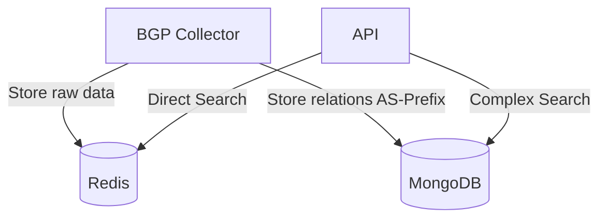

# BGP Monitor 🛰️

Real-time BGP monitoring system using RIPE RIS Live, Redis, MongoDB and FastAPI. Tracks BGP updates and provides advanced network analytics.



## Features ✨

- **Real-time BGP Monitoring** 🔄  
  Connect to RIPE RIS Live stream for live BGP updates
- **Dual Storage System** 💾  
  - Redis: Low-latency current state storage  
  - MongoDB: Historical data and complex relationships
- **ASN/Prefix Tracking** 🎯  
  Filter by specific AS numbers or IP prefixes
- **Advanced Analytics** 📊  
  Trace AS paths and community attributes
- **Containerized** 🐳  
  Full Docker support for easy deployment

## Tech Stack 🛠️

| Component         | Technology                          |
|-------------------|-------------------------------------|
| Core              | Python 3.12                         |
| Real-time Storage | Redis 7                             |
| Historical Data   | MongoDB 6                           |
| API Framework     | FastAPI 0.109                       |
| BGP Data Source   | RIPE RIS Live                       |
| Containerization  | Docker + Docker Compose             |

## Architecture 🏗️



## Getting Started 🚀

### Prerequisites

- Docker Engine ≥ 24.0
- Docker Compose ≥ 2.23
- 4GB RAM + 2 CPU cores recommended

### Installation

```bash
git clone https://github.com/marc-queiroz/bgp-monitor.git
cd bgp-monitor

# Start services
docker-compose up -d --build

# Monitor logs
docker-compose logs -f
```

### Configuration

1. Edit `src/collector.py`:
```python
PEER_ASNS = {"9002"}  # Set target ASNs
RIS_CLIENT_ID = "my-bgp-client-v1"  # Custom client identifier
```

2. Rebuild containers after changes:
```bash
docker-compose build collector
```

## API Endpoints 🌐

| Endpoint                | Description                          | Example                      |
|-------------------------|--------------------------------------|------------------------------|
| `GET /peer/{asn}`       | Get all prefixes for an ASN          | `/peer/327804`               |
| `GET /prefix/{prefix}`  | Find peers announcing a prefix       | `/prefix/146.158.92.0/23`    |
| `GET /origin/{asn}`     | Get prefixes originated by an ASN    | `/origin/213499`             |
| `GET /all`              | Get complete BGP table snapshot      | `/all`                       |

### Example Usage

```bash
# Get current prefixes for AS327804
curl http://localhost:8000/peer/327804

# Find origin of specific prefix
curl http://localhost:8000/origin/213499
```

## Development 🛠️

### VS Code Setup

1. Install [Remote - Containers](https://marketplace.visualstudio.com/items?itemName=ms-vscode-remote.remote-containers)
2. Open project folder
3. `F1` > **Remote-Containers: Reopen in Container**

### Common Commands

```bash
# Access Redis CLI
docker-compose exec redis redis-cli

# Access MongoDB Shell
docker-compose exec mongodb mongosh -u root -p example

# Run tests
docker-compose exec api pytest tests/
```

## Data Model 📦

### Redis Structure
```python
"bgp:peer:{ASN}": {
    "prefix": {
        "as_path": [ASN1, ASN2,...],
        "communities": ["ASN:VAL",...],
        "timestamp": 1739654067.8
    }
}
```

### MongoDB Schema
```javascript
{
  prefix: "146.158.92.0/23",
  as_path: [327804, 6939, 35598, 58002, 213499],
  origin_as: 213499,
  peer_asn: "327804",
  communities: [],
  announcement: true,
  timestamp: ISODate("2025-02-15T17:15:67Z")
}
```

## License 📄

This is free and unencumbered software released into the public domain.

Anyone is free to copy, modify, publish, use, compile, sell, or
distribute this software, either in source code form or as a compiled
binary, for any purpose, commercial or non-commercial, and by any
means.

In jurisdictions that recognize copyright laws, the author or authors
of this software dedicate any and all copyright interest in the
software to the public domain. We make this dedication for the benefit
of the public at large and to the detriment of our heirs and
successors. We intend this dedication to be an overt act of
relinquishment in perpetuity of all present and future rights to this
software under copyright law.

THE SOFTWARE IS PROVIDED "AS IS", WITHOUT WARRANTY OF ANY KIND,
EXPRESS OR IMPLIED, INCLUDING BUT NOT LIMITED TO THE WARRANTIES OF
MERCHANTABILITY, FITNESS FOR A PARTICULAR PURPOSE AND NONINFRINGEMENT.
IN NO EVENT SHALL THE AUTHORS BE LIABLE FOR ANY CLAIM, DAMAGES OR
OTHER LIABILITY, WHETHER IN AN ACTION OF CONTRACT, TORT OR OTHERWISE,
ARISING FROM, OUT OF OR IN CONNECTION WITH THE SOFTWARE OR THE USE OR
OTHER DEALINGS IN THE SOFTWARE.

For more information, please refer to <https://unlicense.org/>


## Acknowledgements 🙏

- RIPE NCC for [RIS Live](https://ris-live.ripe.net/)
- MongoDB for powerful document storage
- FastAPI team for modern Python API framework

---

**Happy Network Monitoring!** 🚀  
_Maintained by Marc Queiroz - [Project Repository](https://github.com/marc-queiroz/bgp-monitor)_